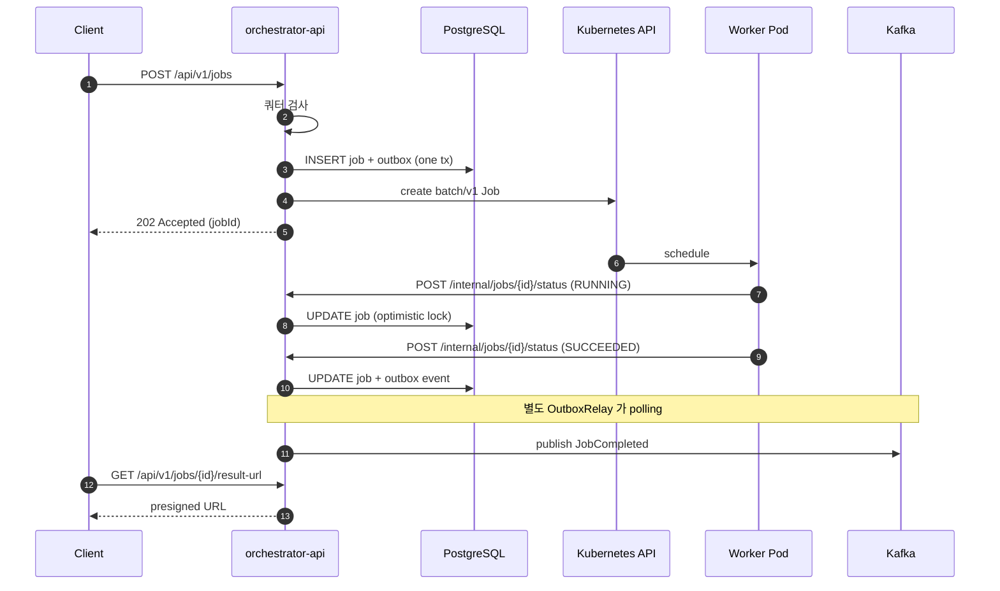

# GPU Job Orchestrator

GPU 학습 / 추론과 같이 장시간 실행되는 비동기 작업을 관리하는 백엔드 API 입니다. 사용자의
작업 요청을 데이터베이스에 기록하고, Kubernetes Job 으로 실행 요청한 뒤, 워커가 작업
완료를 콜백으로 통지하면 상태를 갱신합니다.

본 프로젝트는 백엔드 API 위에 인프라(Terraform, Ansible), GitOps(ArgoCD), 관측(Prometheus,
Grafana, Loki, Tempo) 까지 직접 작성한 코드가 함께 포함되어 있습니다. GPU 작업의 특성상
백엔드만으로는 운영이 성립하지 않기 때문입니다.

## 기술 스택

- **Backend**: Java 17, Spring Boot 3.3, JPA + Flyway, OAuth2 (JWT), Resilience4j
- **Infra (Cloud)**: AWS EKS, Terraform 1.5+, Helm
- **Infra (On-prem)**: Ansible, k3s, NVIDIA driver, Harbor
- **GitOps / CI**: ArgoCD, Argo Rollouts, GitHub Actions, Cosign, Trivy
- **Observability**: Prometheus (kube-prometheus-stack), Grafana, Loki, Tempo, Mimir,
  OpenTelemetry, DCGM exporter
- **Storage / Messaging**: PostgreSQL 16, Redis, Kafka, S3 / MinIO
- **Kubernetes Client**: fabric8-kubernetes-client

## 디렉토리 구조

```
orchestrator-api/      Spring Boot API (도메인, 어댑터, k8s 매니페스트, ADR)
infrastructure/
├── terraform/         VPC, EKS, GPU 노드그룹, kube-prometheus-stack, Loki, Tempo
├── ansible/           온프레미스 노드 부트스트랩 (Docker, NVIDIA driver, k3s)
├── ci-cd/             GitHub Actions + Cosign + Trivy → ArgoCD GitOps
└── observability/     PrometheusRule + Grafana 대시보드 JSON
docs/
├── platform-design.md 운영 환경이 API 설계에 영향을 주는 지점
├── slo.md             SLI / SLO 정의 + error budget 운영 정책
└── runbooks/          장애 대응 runbook 5건
```

## 시스템 흐름



## 백엔드 핵심

`QUEUED → DISPATCHING → RUNNING → SUCCEEDED / FAILED / CANCELLED` 의 상태 머신을 가진 Job
애그리거트가 중심입니다. 사용자별 쿼터(동시 실행 작업 수, GPU 합계)를 단일 aggregate
쿼리로 검사하여 모든 Job 을 메모리에 적재하지 않습니다. 콜백과 취소가 동시에 도착해도
`@Version` 낙관적 락으로 한쪽만 커밋되도록 보호합니다.

DB 트랜잭션 안에서 Outbox 테이블에 이벤트를 함께 INSERT 하고, 별도 `OutboxRelay` 가
polling 으로 Kafka 에 publish 합니다. 발행에 성공한 row 만 `published_at` 을 채우므로
Kafka 가 일시적으로 다운되어도 다음 polling 에서 자동 재시도됩니다.

Kubernetes 호출 (`KubernetesJobDispatcher`) 과 결과 URL 발급 (`PresignedUrlProvider`) 은
인터페이스로 분리하여 dev 에서는 Mock 구현으로 동작하고, 운영에서는 실제 구현으로 교체할
수 있습니다.

테스트는 단위 / 슬라이스 40개와 Postgres Testcontainers 통합 테스트 1개로 구성됩니다.
상세 내용은 [`orchestrator-api/README.md`](orchestrator-api/README.md), 설계 결정 근거는
[ADR 7건](orchestrator-api/docs/adr/), 테이블 / 인덱스 설계는
[database-design.md](orchestrator-api/docs/database-design.md) 를 참고해 주세요.

## DevOps 핵심

`infrastructure/terraform/` 에는 cloud / hybrid / onprem 세 환경의 모듈이 있습니다. 그중
`monitoring/` 모듈 하나로 kube-prometheus-stack, Loki, Tempo, Mimir, DCGM exporter 를 Helm
으로 일괄 배포합니다. GPU 노드는 spot 옵션과 NVIDIA driver 호환 AMI 까지 변수화되어 있습니다.

`infrastructure/ansible/` 은 EKS 같은 매니지드 Kubernetes 가 적합하지 않은 환경 (자체 데이터
센터의 GPU 노드 등) 을 부트스트랩합니다. Docker, NVIDIA driver, k3s, Harbor, monitoring
agent 를 자동으로 설치합니다.

`infrastructure/ci-cd/` 의 GitHub Actions 가 단위, 슬라이스, Testcontainers IT 를 분리하여
실행하고, 이미지 빌드 후 Trivy 로 HIGH / CRITICAL 취약점을 fail 처리합니다. Cosign keyless
서명이 적용되며, 태그 푸시 시 별도 GitOps 저장소의 kustomize image tag 가 자동 갱신되어
ArgoCD 가 동기화합니다. 운영 배포는 Argo Rollouts 의 canary 로 진행됩니다.

`infrastructure/observability/` 에는 알림과 대시보드가 JSON / YAML 로 관리됩니다. Grafana UI
에서 클릭으로 만든 대시보드는 변경 추적과 PR 리뷰가 불가능하므로 코드로 두는 것을 원칙으로
했습니다. Prometheus 알림 9건 (5xx 비율, p95 latency, Outbox lag, K8s API 실패, Job 실패율
등) 은 모두 [runbook](docs/runbooks/) 으로 직접 link 됩니다. 장애 대응 시 알림에서 바로
대응 절차로 이동할 수 있도록 한 구성입니다.

`docs/slo.md` 에 가용성 99.9%, p95 300ms, Job 성공률 99% 의 SLO 정의와 error budget 90% /
100% 소진 시의 운영 정책을 정리했습니다. `docs/runbooks/` 에는 5건의 장애 대응 문서 (5xx
폭증, Outbox 지연, 콜백 유실, K8s API 다운, GPU OOM) 를 두었습니다.

`orchestrator-api/k8s/security/` 에는 default-deny 환경에서 동작하는 NetworkPolicy 와
PodDisruptionBudget 이 있습니다. ingress 는 ingress-nginx, 워커 namespace, Prometheus 만
허용하고, egress 는 DNS, K8s API, DB, Redis, Kafka, OTel collector 만 허용하는 방식입니다.

## 코드 리뷰 가이드

백엔드 흐름은 다음 순서로 보시면 이해가 빠릅니다.

1. [`Job`](orchestrator-api/src/main/java/com/example/gwp/orchestrator/domain/Job.java):
   상태 변경을 setter 가 아닌 메서드로만 노출하여 불변식을 보호하는 구조입니다.
2. [`JobSubmissionService`](orchestrator-api/src/main/java/com/example/gwp/orchestrator/domain/JobSubmissionService.java):
   쿼터 검사 → DB 저장 → Kubernetes 호출 → Outbox 기록의 순서를 확인할 수 있습니다.
3. [`JobLifecycleService`](orchestrator-api/src/main/java/com/example/gwp/orchestrator/domain/JobLifecycleService.java):
   콜백 / 취소 처리 로직과 종료된 Job 에 대한 중복 콜백 무시 (멱등성) 처리가 있습니다.
4. [`OutboxRelay`](orchestrator-api/src/main/java/com/example/gwp/orchestrator/outbox/OutboxRelay.java):
   Kafka 발행과 published 마킹 흐름을 확인할 수 있습니다.

DevOps 측면에서는 다음 다섯 파일이 핵심입니다.

1. [`monitoring/main.tf`](infrastructure/terraform/modules/monitoring/main.tf): 관측 stack
   전체를 단일 모듈로 구성한 부분입니다.
2. [`orchestrator-slo.yaml`](infrastructure/observability/prometheus-rules/orchestrator-slo.yaml):
   SLO 알림이 runbook URL 까지 어떻게 연결되는지 확인할 수 있습니다.
3. [`orchestrator-overview.json`](infrastructure/observability/grafana-dashboards/orchestrator-overview.json):
   대시보드를 코드로 관리하는 방식 (Terraform `grafana_dashboard` 또는 sidecar 로 import).
4. [`network-policy.yaml`](orchestrator-api/k8s/security/network-policy.yaml): default-deny
   환경에서 동작하는 ingress / egress 규칙입니다.
5. [`orchestrator-api-release.yml`](infrastructure/ci-cd/github-actions/orchestrator-api-release.yml):
   PR 부터 운영 배포까지의 CI/CD 전체 흐름입니다.

## 빠른 실행

H2 와 Mock K8s 모드로 외부 의존성 없이 실행 가능합니다.

```bash
cd orchestrator-api
./gradlew bootRun
```

```bash
curl -s -X POST http://localhost:8080/api/v1/jobs \
  -H 'Content-Type: application/json' \
  -d '{"inputUri":"s3://demo/in.bin","image":"gpu-worker:1.0","gpuCount":1,"priority":"NORMAL"}' \
  | tee /tmp/job.json | jq

JOB_ID=$(jq -r .id /tmp/job.json)
curl -s "http://localhost:8080/api/v1/jobs/$JOB_ID" | jq
curl -s "http://localhost:8080/api/v1/jobs/$JOB_ID/result-url" | jq
```

API 문서: <http://localhost:8080/swagger>

## 현재 상태

API, 도메인, 사용자별 쿼터, Kubernetes 호출, Outbox, JWT 인증, Redis 조회 캐시, 41개의
테스트, Terraform / Ansible / ArgoCD 구성, Prometheus + Grafana + runbook 까지 포함되어
있습니다. S3 / MinIO presigned URL 만 아직 Mock 구현이며 인터페이스(`PresignedUrlProvider`)
가 준비된 상태입니다.

## 향후 개선 사항

- `Idempotency-Key` 헤더 처리 (네트워크 재시도 안전성)
- 콜백 mTLS 전환 (현재는 공유 시크릿)
- Resilience4j 서킷 브레이커 (K8s API / Kafka 장애 격리)
- Job timeout 감시 작업 (Spring Scheduling + ShedLock)
- Outbox 다중 인스턴스 처리 (`SKIP LOCKED` 또는 ShedLock)
