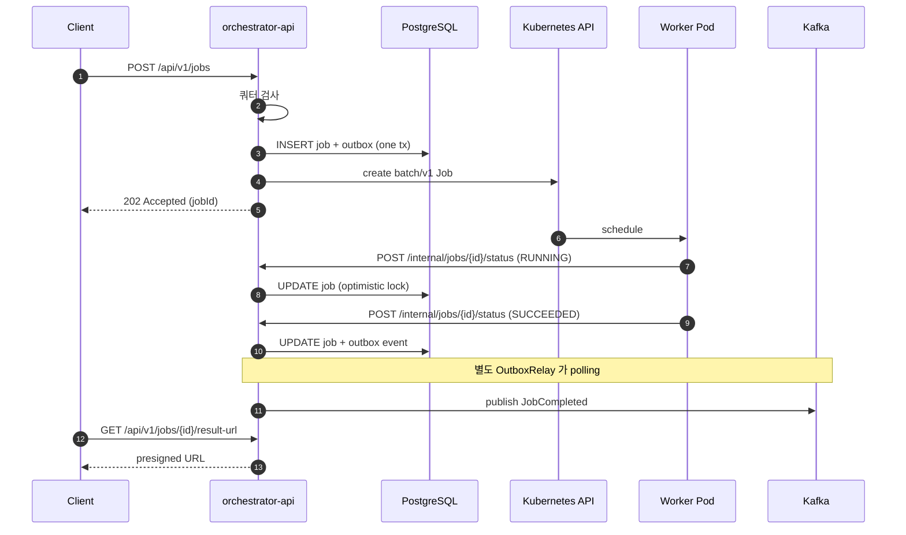
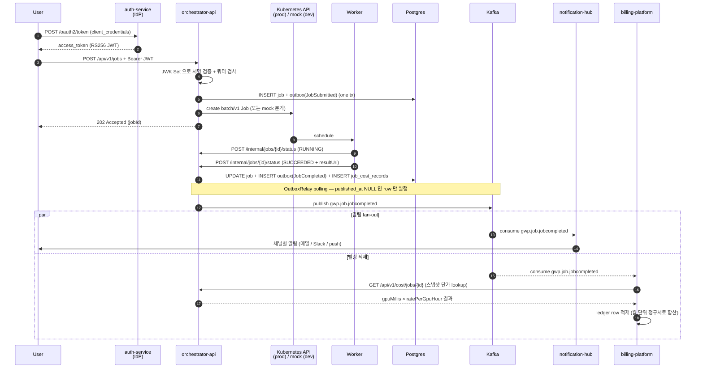

# GPU Job Orchestrator

[](LICENSE)
[](orchestrator-api/build.gradle.kts)
[](orchestrator-api/build.gradle.kts)
[](worker/go.mod)
[](helm/gpu-job-orchestrator/)

> 빌드 / 릴리스 CI workflow ([orchestrator-api-release.yml](infrastructure/ci-cd/github-actions/orchestrator-api-release.yml),
> [load-test-nightly.yml](infrastructure/ci-cd/github-actions/load-test-nightly.yml)) 는
> 스냅샷 (`.github/workflows/` 가 아니라 `infrastructure/ci-cd/github-actions/` 아래의
> 참고용 파일) 이라 build status badge 는 의도적으로 두지 않았습니다. 자세한 이유는
> README 의 "공급망 보안" / "DevOps 핵심" 섹션 참고. 한편 의존성 점검
> ([dependabot.yml](.github/dependabot.yml)) 과 SAST ([codeql.yml](.github/workflows/codeql.yml))
> 는 실제로 동작해야 의미가 있어 `.github/` 아래에 두었고, 결과는 GitHub Security 탭에
> 누적됩니다 (status badge 가 아니라 finding 단위 추적이라 README badge 는 두지 않음).

GPU 학습 / 추론과 같이 장시간 실행되는 비동기 작업을 관리하는 백엔드 API 입니다. 사용자의
작업 요청을 데이터베이스에 기록하고, Kubernetes Job 으로 실행 요청한 뒤, 워커가 작업
완료를 콜백으로 통지하면 상태를 갱신합니다.

본 프로젝트는 백엔드 API 위에 인프라(Terraform, Ansible), GitOps(ArgoCD), 관측(Prometheus,
Grafana, Loki, Tempo) 까지 직접 작성한 코드가 함께 포함되어 있습니다. GPU 작업의 특성상
백엔드만으로는 운영이 성립하지 않기 때문입니다.

## 기술 스택

- **Backend**: Java 17, Spring Boot 3.3, JPA + Flyway, OAuth2 (JWT), Resilience4j
- **Worker**: Go 1.22 (job 처리 + 콜백 + Prometheus metric)
- **Infra (Cloud)**: AWS EKS, Terraform 1.5+, Helm
- **Infra (On-prem)**: Ansible, k3s, NVIDIA driver, Harbor
- **GitOps / CI**: ArgoCD, Argo Rollouts, GitHub Actions, Cosign (이미지 서명), Syft (SBOM — 어떤 라이브러리가 들어갔는지 명세하는 부품 목록), Trivy (취약점 스캐너)
- **Autoscaling**: KEDA (이벤트 기반 자동 확장 — Kafka 큐 적체 등을 트리거로 Pod 수 조절), Cluster Autoscaler (priority expander — 어떤 노드 풀을 먼저 쓸지 우선순위 지정)
- **Observability**: Prometheus (kube-prometheus-stack), Grafana, Loki (로그 저장소), Tempo (트레이스 저장소), Mimir (Prometheus 장기 저장소),
  OpenTelemetry, DCGM exporter (NVIDIA GPU 메트릭)
- **Security**: Kyverno cluster policies (Pod 생성 시 정책 강제 — 서명 안 된 이미지 거부 등), External Secrets Operator (AWS Secrets Manager 의 비밀값을 K8s Secret 으로 동기화),
  Falco runtime detection (실행 중인 컨테이너의 의심 동작 감지), Cosign attestation (이미지에 메타데이터 증명서 첨부)
- **Resilience**: Velero 백업, Chaos Mesh 정기 실험 (의도적으로 장애를 주입해서 시스템 복원력 검증)
- **Load Test**: K6 (CI 가 매일 야간에 부하 테스트 자동 실행)
- **Storage / Messaging**: PostgreSQL 16, Redis, Kafka, S3 / MinIO

## 디렉토리 구조

```
orchestrator-api/        Spring Boot API (도메인, 어댑터, k8s 매니페스트, ADR 25건)
worker/                  Go GPU 워커 시뮬레이터 (실제 동작)
tests/load/              K6 부하 테스트 (5 시나리오 — lib/ + scenarios/)
helm/gpu-job-orchestrator/ Helm chart (dev / prod values 분리, leader election 토글)
infrastructure/
├── terraform/           VPC, EKS, GPU 노드그룹, 모니터링 stack
├── ansible/             온프레미스 노드 부트스트랩
├── ci-cd/               GitHub Actions + Cosign + SBOM + ArgoCD GitOps
├── keda/                ScaledJob (Kafka lag → GPU 워커 자동 확장) + priority class
├── observability/       PrometheusRule + Grafana 대시보드 JSON
├── security/
│   ├── kyverno/         Cluster policy 6건 (서명 강제, privileged 차단 등)
│   ├── external-secrets/  AWS Secrets Manager 연동
│   └── falco/           Runtime detection rules
├── dr/velero/           백업 스케줄 + restore 절차
└── chaos/               Chaos Mesh 실험 5건
docs/
├── platform-design.md   운영 환경이 API 설계에 영향을 주는 지점
├── slo.md               SLI / SLO 정의 + error budget 운영 정책
├── runbooks/            장애 대응 runbook 5건
└── dr/
    ├── dr-runbook.md    Disaster Recovery 절차 + RTO/RPO
    └── chaos-results.md Chaos 실험 결과 누적
```

## 시스템 흐름



## 백엔드 핵심

`QUEUED → DISPATCHING → RUNNING → SUCCEEDED / FAILED / CANCELLED` 의 상태 머신을 가진 Job
애그리거트 (도메인 단위로 묶어 함께 변경되는 객체 그룹) 가 중심입니다. 사용자별 쿼터
(동시 실행 작업 수, GPU 합계) 를 단일 aggregate 쿼리 (한 번의 SUM/COUNT 쿼리) 로 검사하여
모든 Job 을 메모리에 적재하지 않습니다. 콜백과 취소가 동시에 도착해도 `@Version` 낙관적
락 (충돌이 드물 거란 가정으로 일단 커밋 시도, 충돌 나면 한쪽만 살림) 으로 한쪽만
커밋되도록 보호합니다.

DB 트랜잭션 안에서 Outbox 테이블 (DB 에 이벤트를 일단 적어 놓는 발신함) 에 이벤트를
함께 INSERT 하고, 별도 `OutboxRelay` 가 polling 으로 Kafka 에 publish 합니다. 발행에
성공한 row 만 `published_at` 을 채우므로 Kafka 가 일시적으로 다운되어도 다음 polling
에서 자동 재시도됩니다.

Kubernetes 호출 (`KubernetesJobDispatcher`) 과 결과 URL 발급 (`PresignedUrlProvider`) 은
인터페이스로 분리하여 dev 에서는 Mock 구현으로 동작하고, 운영에서는 실제 구현으로 교체할
수 있습니다.

테스트는 단위 / 슬라이스 45개와 Postgres Testcontainers 통합 테스트 1개로 구성됩니다.
상세 내용은 [`orchestrator-api/README.md`](orchestrator-api/README.md), 설계 결정 근거는
[ADR 25건](orchestrator-api/docs/adr/), 테이블 / 인덱스 설계는
[database-design.md](orchestrator-api/docs/database-design.md) 를 참고해 주세요.

## DevOps 핵심

`infrastructure/terraform/` 에는 cloud / hybrid / onprem 세 환경의 모듈이 있습니다. 그중
`monitoring/` 모듈 하나로 kube-prometheus-stack, Loki, Tempo, Mimir, DCGM exporter 를 Helm
으로 일괄 배포합니다. GPU 노드는 spot 옵션과 NVIDIA driver 호환 AMI 까지 변수화되어 있습니다.

`infrastructure/ansible/` 은 EKS 같은 매니지드 Kubernetes 가 적합하지 않은 환경 (자체 데이터
센터의 GPU 노드 등) 을 부트스트랩합니다. Docker, NVIDIA driver, k3s, Harbor, monitoring
agent 를 자동으로 설치합니다.

`infrastructure/ci-cd/` 의 GitHub Actions 가 단위, 슬라이스, Testcontainers IT 를 분리하여
실행하고, 이미지 빌드 후 Trivy 로 HIGH / CRITICAL 취약점을 fail 처리합니다. Cosign keyless
서명이 적용되며, 태그 푸시 시 별도 GitOps 저장소의 kustomize image tag 가 자동 갱신되어
ArgoCD 가 동기화합니다. 운영 배포는 Argo Rollouts 의 canary 로 진행됩니다.

`infrastructure/observability/` 에는 알림과 대시보드가 JSON / YAML 로 관리됩니다. Grafana UI
에서 클릭으로 만든 대시보드는 변경 추적과 PR 리뷰가 불가능하므로 코드로 두는 것을 원칙으로
했습니다. Prometheus 알림 12건 (5xx 비율, 응답 시간 p95 — 100명 중 95번째로 느린 요청
기준, Outbox 발행 지연, K8s API 호출 실패, Job 실패율 등) 은 모두 [runbook](docs/runbooks/)
(장애 대응 절차서) 으로 직접 연결됩니다. 장애 대응 시 알림에서 바로 대응 절차로 이동할
수 있도록 한 구성입니다.

`docs/slo.md` 에 가용성 99.9%, p95 300ms, Job 성공률 99% 의 SLO (Service Level Objective —
서비스가 지켜야 할 목표 수치) 정의와 error budget (목표 미달이 허용되는 여유분) 90% /
100% 소진 시의 운영 정책을 정리했습니다. `docs/runbooks/` 에는 5건의 장애 대응 문서 (5xx
폭증, Outbox 발행 지연, 콜백 유실, K8s API 다운, GPU OOM) 를 두었습니다.

`orchestrator-api/k8s/security/` 에는 default-deny 환경 (모든 트래픽을 일단 차단하고
허용된 것만 통과) 에서 동작하는 NetworkPolicy (Pod 사이 트래픽 방화벽 규칙) 와
PodDisruptionBudget (배포·업그레이드 중 동시에 죽일 수 있는 Pod 개수 제한) 이 있습니다.
ingress 는 ingress-nginx, 워커 namespace, Prometheus 만 허용하고, egress 는 DNS, K8s API,
DB, Redis, Kafka, OTel collector 만 허용하는 방식입니다.

## Helm chart

`helm/gpu-job-orchestrator/` 가 단일 환경에 박혀 있던 `orchestrator-api/k8s/` 매니페스트를
환경별로 분리한 chart 입니다. dev 는 `values.yaml` 기본값 (replica 1, leader=shedlock,
ingress / HPA / PDB / NetworkPolicy 모두 off), prod 는 `values-prod.yaml` 가 위에 얹혀
replica 3, HPA 3 ~ 12, ingress TLS (cert-manager), PDB minAvailable=2, NetworkPolicy 활성,
leader=lease (K8s coordination/Lease) 로 바뀝니다. 같은 chart 가 두 모드를 모두 지원하므로
환경별 분기가 템플릿 안에 박힐 일이 없고, `helm diff` 로 변경 추적도 깔끔합니다.

ServiceAccount 에는 두 종류의 RBAC Role 이 따라옵니다. `gwp-jobs` namespace 의 batch/v1
Job 생성 / 조회 / delete 권한 (KubernetesJobDispatcher 가 워커 Pod 을 띄울 때 필요),
그리고 자기 namespace 의 `coordination.k8s.io/Lease` 권한 (lease 모드의 leader election).
Role 의 namespace 가 분리되어 있어 orchestrator 가 다른 namespace 의 Pod 까지 만질 수 없게
폭발 반경을 좁혔습니다.

```bash
# dev (로컬 K8s — kind / k3s)
helm install orchestrator-api helm/gpu-job-orchestrator/ -n gwp --create-namespace

# prod (cert-manager / NetworkPolicy CNI 가 미리 깔린 클러스터)
helm upgrade --install orchestrator-api helm/gpu-job-orchestrator/ \
  -n gwp -f helm/gpu-job-orchestrator/values-prod.yaml \
  --set image.tag=$IMAGE_TAG \
  --set callback.existingSecret=orchestrator-callback-external

# 검증 — CI 에서 PR 마다 lint + template 으로 schema 회귀 차단
helm lint helm/gpu-job-orchestrator/
helm template t helm/gpu-job-orchestrator/ -f helm/gpu-job-orchestrator/values-prod.yaml \
  | kubectl apply --dry-run=client -f -
```

ingress 는 실제로 구현된 컨트롤러 경로 3 종 (`/api/v1/jobs`, `/api/v1/cost`,
`/api/v1/preemption-history`) 만 노출하고, 워커 → orchestrator 콜백 (`/internal/*`) 은
prod 의 nginx `server-snippet` annotation 으로 ingress 단에서 차단됩니다. 클러스터 내부
콜백은 Service 의 ClusterIP 를 직접 호출하므로 외부에 열릴 이유가 없습니다. ingress
path 를 실제 엔드포인트와 1:1 로 맞추는 배경은
[OWASP API9 매핑](docs/security/owasp-mapping.md) 참고.

기존 `orchestrator-api/k8s/` 의 정적 매니페스트는 ADR / 학습 자료 성격으로 그대로 두고,
실제 배포 경로는 chart 로 일원화합니다. ArgoCD application 은 chart 의 git ref 와
values-prod.yaml 을 참조해 동기화합니다 (`infrastructure/ci-cd/argocd/`).

## 실제 워커 + Autoscaling

`worker/` 의 Go 워커가 실제로 동작합니다. orchestrator-api 가 K8s Job 으로 띄우면
워커가 RUNNING 콜백 → GPU 작업 시뮬레이션 (sleep + CPU burn) → SUCCEEDED 콜백을 보내고
종료합니다. Prometheus 메트릭, 콜백 재시도 (지수 백오프 — 실패할수록 재시도 간격을
늘림), graceful shutdown (작업 마무리 후 깔끔하게 종료) 모두 포함.

`infrastructure/keda/` 의 KEDA `ScaledJob` 이 Kafka `gwp.job.queue` 토픽의 lag (아직 처리
안 된 메시지 양) 를 보고 워커 Pod 를 0 ↔ N 사이로 자동 확장합니다 (idle 시 GPU 비용 0,
burst 시 5초 polling 으로 빠른 scale-up — 빠르게 Pod 늘리기). Cluster Autoscaler 의
priority expander 는 spot (스팟 인스턴스 — 정가보다 싸지만 언제든 회수될 수 있는 노드)
GPU 노드를 우선 사용해 비용을 줄입니다.

`tests/load/k6/scenarios/` 의 K6 시나리오 5건 (job-submit, job-callback, dag-submit,
cost-query, queue-depth) 이 SLO regression (성능 목표 후퇴) 을 nightly CI (매일 야간 자동
빌드) 로 검증합니다. 각 시나리오의 thresholds — submit p95 < 100ms, callback p95 < 50ms,
DAG child p95 < 500ms, cost-query p95 < 200ms, queue depth 불변식 — 중 하나라도 어기면
fail. 실행은 `./scripts/run-load.sh` 가 5종 일괄로, 상세는
[`tests/load/README.md`](tests/load/README.md) 참고.

## 공급망 보안

CI 가 매 빌드마다 다음을 수행합니다 (공급망 보안 = 코드가 빌드되어 운영에 도달하는
모든 단계에서 변조·악성 의존성을 차단):

1. **Trivy** — 이미지 취약점 스캔 (HIGH/CRITICAL 등급 발견 시 빌드 실패)
2. **Syft** — SBOM (Software Bill of Materials, 어떤 라이브러리·버전이 들어갔는지의
   부품 목록) 생성, CycloneDX 형식
3. **Cosign** — 이미지 + SBOM 에 keyless OIDC attestation (Cosign 으로 서명하되 키 파일
   대신 GitHub OIDC 토큰으로 신원 증명, 서명 기록은 공개 transparency log 에 남김)
4. **Trivy SBOM scan** — SBOM 자체로도 재검사

K8s 측 [`Kyverno cluster policies`](infrastructure/security/kyverno/) (admission webhook —
Pod 가 만들어지기 직전에 정책을 검사해서 거절할 수 있는 훅) 6건이 admission 단계에서:
- Cosign 으로 서명된 이미지만 허용 (`gwp/*` namespace)
- privileged Pod (호스트 권한까지 갖는 위험한 Pod) 차단
- runAsNonRoot (root 가 아닌 사용자로 실행) + resource limits 필수
- `:latest` 태그 금지 (어떤 버전이 떠 있는지 추적 불가하기 때문)
- hostNetwork/PID/IPC (호스트의 네트워크·프로세스·메모리 공간에 직접 붙는 옵션) 차단

자격 증명은 [`External Secrets Operator`](infrastructure/security/external-secrets/) 가
AWS Secrets Manager 에서 5분 주기로 동기화. K8s `Secret` YAML 을 git 에 commit 하지 않음.

런타임 보안은 [`Falco`](infrastructure/security/falco/) custom rules — 워커 Pod 가 shell
spawn (셸 프로세스 실행) / 민감 파일 접근 / 의심 syscall (시스템 호출) 시 즉시 alert.

## 백업 / Disaster Recovery

[`Velero`](infrastructure/dr/velero/) (K8s 클러스터 백업·복원 도구) 가 두 schedule 로 백업:
- 매시간 Postgres PVC (DB 가 쓰는 디스크 볼륨, 24시간 보관)
- 매일 새벽 namespace 전체 (30일 보관, cross-region S3 replication — 다른 리전 S3 로 복제)

[`docs/dr/dr-runbook.md`](docs/dr/dr-runbook.md) 에 시나리오별 복구 절차와 RTO 30분 (장애
발생부터 복구 완료까지 목표 시간) / RPO 5분 (잃어도 되는 데이터의 최대 시간 범위) 의
SLO. 분기별 DR drill (실제 복구 훈련) 결과를 누적.

## Chaos Engineering

Chaos Engineering = 의도적으로 장애를 주입해서 시스템이 정말 회복되는지 검증하는 실험.
[`infrastructure/chaos/`](infrastructure/chaos/) 의 Chaos Mesh 실험 5건이 정기 실행:
- Pod kill — Pod 강제 종료, PDB (PodDisruptionBudget — 동시 종료 가능 Pod 제한) 효과 확인, 주 1회
- Postgres network delay — DB 응답 지연 주입, HikariCP (DB 커넥션 풀) 동작 확인
- Kafka partition 격리 — Kafka 와의 네트워크 단절, Outbox 자동 복구 확인
- Worker CPU stress — 워커 CPU 를 90% 까지 부하, 콜백 재시도 동작 확인
- GPU 노드 drain — GPU 노드를 강제 비움, Job 자동 재제출 확인

가설이 깨진 사례와 그에 따른 코드 수정 이력은
[`docs/dr/chaos-results.md`](docs/dr/chaos-results.md) 에 기록.

## 코드 리뷰 가이드

백엔드 흐름은 다음 순서로 보시면 이해가 빠릅니다.

1. [`Job`](orchestrator-api/src/main/java/com/example/gwp/orchestrator/domain/Job.java):
   상태 변경을 setter 가 아닌 메서드로만 노출하여 불변식을 보호하는 구조입니다.
2. [`JobSubmissionService`](orchestrator-api/src/main/java/com/example/gwp/orchestrator/application/JobSubmissionService.java):
   쿼터 검사 → DB 저장 → Kubernetes 호출 → Outbox 기록의 순서를 확인할 수 있습니다.
3. [`JobLifecycleService`](orchestrator-api/src/main/java/com/example/gwp/orchestrator/application/JobLifecycleService.java):
   콜백 / 취소 처리 로직과 종료된 Job 에 대한 중복 콜백 무시 (멱등성) 처리가 있습니다.
4. [`OutboxRelay`](orchestrator-api/src/main/java/com/example/gwp/orchestrator/outbox/OutboxRelay.java):
   Kafka 발행과 published 마킹 흐름을 확인할 수 있습니다.

DevOps 측면에서는 다음 다섯 파일이 핵심입니다.

1. [`monitoring/main.tf`](infrastructure/terraform/modules/monitoring/main.tf): 관측 stack
   전체를 단일 모듈로 구성한 부분입니다.
2. [`orchestrator-slo.yaml`](infrastructure/observability/prometheus-rules/orchestrator-slo.yaml):
   SLO 알림이 runbook URL 까지 어떻게 연결되는지 확인할 수 있습니다.
3. [`orchestrator-overview.json`](infrastructure/observability/grafana-dashboards/orchestrator-overview.json):
   대시보드를 코드로 관리하는 방식 (Terraform `grafana_dashboard` 또는 sidecar 로 import).
4. [`network-policy.yaml`](orchestrator-api/k8s/security/network-policy.yaml): default-deny
   환경에서 동작하는 ingress / egress 규칙입니다.
5. [`orchestrator-api-release.yml`](infrastructure/ci-cd/github-actions/orchestrator-api-release.yml):
   PR 부터 운영 배포까지의 CI/CD 전체 흐름입니다.

## 빠른 실행

H2 와 Mock K8s 모드로 외부 의존성 없이 실행 가능합니다.

```bash
cd orchestrator-api
./gradlew bootRun
```

```bash
curl -s -X POST http://localhost:8080/api/v1/jobs \
  -H 'Content-Type: application/json' \
  -d '{"inputUri":"s3://demo/in.bin","image":"gpu-worker:1.0","gpuCount":1,"priority":"NORMAL"}' \
  | tee /tmp/job.json | jq

JOB_ID=$(jq -r .id /tmp/job.json)
curl -s "http://localhost:8080/api/v1/jobs/$JOB_ID" | jq
curl -s "http://localhost:8080/api/v1/jobs/$JOB_ID/result-url" | jq
```

API 문서: <http://localhost:8080/swagger>

## DLQ 운영 가이드 (admin 콘솔)

영구 실패한 메시지 — Outbox `dead_lettered_at` 격리, worker 콜백 retry exhausted,
K8s dispatch 실패, DAG eval 실패, preemption 실패 — 를 운영자가 한 화면에서 보고
replay / discard 하기 위한 8개 admin endpoint 가 `/api/v1/admin/dlq/*` 에 있습니다.
배경 / 결정 근거는 [ADR-0026](orchestrator-api/docs/adr/0026-dlq-admin-api.md).

권한은 `ROLE_admin` 필요 (`@PreAuthorize` + 컨트롤러 본문의 `Caller.isAdmin` 이중
방어). 로컬 dev (Permissive 모드) 에서는 `X-User-Roles: admin` 헤더로 모의
가능합니다.

```bash
# 1. 목록 — source / topic / 시간 구간 / errorType 으로 필터, cursor pagination
curl -s "http://localhost:8080/api/v1/admin/dlq?source=OUTBOX&size=20" | jq

# 2. 단건 detail — 전체 payload
curl -s "http://localhost:8080/api/v1/admin/dlq/<messageId>" | jq

# 3. 단건 replay — Idempotency-Key 헤더 권장 (같은 키로 두 번 호출되면 IGNORED)
curl -s -X POST "http://localhost:8080/api/v1/admin/dlq/<messageId>/replay" \
  -H 'Idempotency-Key: ops-2026-05-15-001' | jq

# 4. 단건 discard — reason 필수 (audit 에 그대로 보존)
curl -s -X POST "http://localhost:8080/api/v1/admin/dlq/<messageId>/discard" \
  -H 'Content-Type: application/json' \
  -d '{"reason":"obsolete — job already CANCELLED by user"}' | jq

# 5. bulk dry-run — confirm 없으면 자동 dry-run, matched 카운트만 응답
curl -s -X POST "http://localhost:8080/api/v1/admin/dlq/bulk-discard" \
  -H 'Content-Type: application/json' \
  -d '{"source":"OUTBOX","from":"2026-05-14T00:00:00Z","to":"2026-05-15T00:00:00Z"}' | jq

# 6. bulk 실제 실행 — confirm=true + reason 필수 (discard)
curl -s -X POST "http://localhost:8080/api/v1/admin/dlq/bulk-discard?confirm=true" \
  -H 'Content-Type: application/json' \
  -d '{"source":"OUTBOX","from":"2026-05-14T00:00:00Z","to":"2026-05-15T00:00:00Z","reason":"K8s API outage cleanup"}' | jq

# 7. bulk job 진행 폴링 — 응답의 jobId 로 status / matched / succeeded / failed / skipped 추적
curl -s "http://localhost:8080/api/v1/admin/dlq/bulk-jobs/<jobId>" | jq

# 8. stats — source / topic / owner / gpuClass / errorType / 시간 bucket 분포
curl -s "http://localhost:8080/api/v1/admin/dlq/stats?from=2026-05-14T00:00:00Z&to=2026-05-15T00:00:00Z&bucket=PT1H" | jq
```

`DlqSource` 5값 (JOB_DISPATCH / CALLBACK / OUTBOX / PREEMPTION / DAG_EVAL) 으로 saga
단계별 분리. bulk 는 source 필수 — 한 번에 한 단계만 조작해 의미가 섞이지 않게.
`stats.byOwner` 차원으로 같은 owner 의 잡이 한꺼번에 stuck 된 패턴 (잘못된 입력 URI
등) 감지, `stats.byGpuClass` 차원으로 H100 / A100 / V100 별 dispatch failure 분포로
preemption 정책 튜닝 신호.

callback replay 의 안전성은 `JobLifecycleService` 의 *already-terminal* short-circuit
(이미 종료된 잡 콜백은 자동 no-op) 과 DLQ store 의 idempotencyKey 가 합쳐진 두 겹 보호.

## Portfolio Set 통합

본 레포는 단독으로도 동작하지만, 다음 8 레포가 한 시스템처럼 맞물리는 portfolio set 의
한 축입니다. 프로필 README — <https://github.com/ssa1004/ssa1004> — 에 전체 그림이 있습니다.

| 레포 | 한 줄 | 본 레포에서 본 관계 |
| --- | --- | --- |
| [auth-service](https://github.com/ssa1004/auth-service) | OAuth2 / OIDC IdP — JWT 발행 / JWK rotation / 2FA / introspect / revoke | 들어오는 요청 JWT 를 본 레포가 JWK Set 으로 검증 |
| [notification-hub](https://github.com/ssa1004/notification-hub) | 멀티채널 알림 (이메일 / SMS / push / Slack) | 본 레포가 발행하는 `gwp.job.jobcompleted` / `jobpreempted` Kafka 이벤트를 consume → 사용자에게 fan-out |
| [billing-platform](https://github.com/ssa1004/billing-platform) | 사용량 집계 / 청구서 / 결제 게이트웨이 | `gwp.job.jobcompleted` 를 consume 해 `gpuMillis × ratePerGpuHour` 로 ledger 적재 (종료 시점 단가는 본 레포의 `JobCostRecord` 에도 스냅샷으로 보관) |
| [security-log-search](https://github.com/ssa1004/security-log-search) | SIEM — 감사 로그 / 보안 이벤트 검색 | 본 레포의 K8s audit log 를 본 레포 밖에서 ECS 매핑 후 ingest |
| [search-service](https://github.com/ssa1004/search-service) | 일반 도메인 검색 (상품 / 문서) | 본 레포와 직접 의존 없음 (portfolio set 의 다른 축) |
| [bid-ask-marketplace](https://github.com/ssa1004/bid-ask-marketplace) | 리셀 주문장 매칭 엔진 | 본 레포와 직접 의존 없음 (portfolio set 의 다른 축) |
| [commerce-ops](https://github.com/ssa1004/commerce-ops) | OTel / Prometheus / Loki 플레이그라운드 | observability stack 공통 — 본 레포의 Grafana dashboard 가 같은 패턴 |
| **gpu-job-orchestrator** | 본 레포 — GPU job 큐 / 스케줄러 | — |

본 레포의 통합점은 세 방향:

1. **들어오는 인증** — auth-service 의 JWK Set (`/oauth2/jwks`) 으로 사용자 / DAG 등록 / cancel
   요청의 JWT 검증. claim 의 `sub` 가 `Job.owner` 로 박힘.
2. **나가는 알림** — Job 종착 (`SUCCEEDED` / `FAILED`) 또는 preemption 시 Outbox →
   Kafka publish → notification-hub consume.
3. **나가는 빌링** — `JobCompleted` 이벤트에 담긴 `finishedAt` 과 본 레포의 cost ledger
   (`/api/v1/cost/jobs/{id}` — 종료 시점 단가 스냅샷) 를 billing-platform 이 합쳐 청구.

### Cross-repo sequence — 사용자 JWT 부터 알림 / 빌링까지



### 통합 시연 (mock)

전체 portfolio 를 다 띄울 필요 없이, **mock auth-service + mock notification-hub + mock
billing-platform** 로 본 레포의 통합점을 한 호스트에서 검증:

```bash
# orchestrator-api (자기 자신) + Postgres + Kafka + 3 stub 한 번에 띄움
docker compose -f infrastructure/docker/docker-compose.integration.yml up -d --build

# JWT 발급 → job 제출 → 워커 콜백 → notification + billing stub 양쪽이 받았는지 확인
./scripts/integration-demo.sh
```

데모는 외부 API 호출 없이 컨테이너 안에서 닫혀 있습니다. K8s 호출은 본 레포의
`gwp.kubernetes.enabled=false` 분기 (`MockJobDispatcher`) 로 대체되고, 워커 콜백은 데모
스크립트가 직접 발사합니다. 자세한 흐름은 [scripts/integration-demo.sh](scripts/integration-demo.sh)
헤더 주석.

## 현재 상태

API, 도메인, 사용자별 쿼터, Kubernetes 호출, Outbox, JWT 인증, Redis 조회 캐시, 46개의
테스트 (45 단위·슬라이스 + 1 Postgres Testcontainers IT), Terraform / Ansible / ArgoCD 구성,
Prometheus + Grafana + runbook 까지 포함되어 있습니다. S3 / MinIO presigned URL 만 아직
Mock 구현이며 인터페이스 (`PresignedUrlProvider`) 가 준비된 상태입니다.

운영 안정성 측면에서 ShedLock + K8s Lease 이중 leader election (ADR-0017),
Resilience4j 서킷 브레이커 + Retry with jitter (ADR-0025), graceful shutdown
(ADR-0024), 3종 probe 분리 (ADR-0023), OTel W3C trace context + Baggage Kafka 헤더
전파 (ADR-0018, 0021), Prometheus exemplars (ADR-0019), AsyncAPI + consumer-driven
contract test (ADR-0020) 까지 적용되어 있습니다. 전체 결정 목록은 [ADR 인덱스](orchestrator-api/docs/adr/) 를 참고해 주세요.

## 향후 개선 사항

- S3 / MinIO `PresignedUrlProvider` 운영 구현 (현재 Mock. presigned URL = 일정 시간만
  유효한 다운로드 링크)
- 콜백 mTLS 전환 (현재는 공유 시크릿. mTLS = 클라이언트와 서버가 서로 인증서 검증)
- `Idempotency-Key` 헤더 처리 — 같은 요청이 두 번 와도 한 번만 처리되게 막는 헤더
  (네트워크 재시도 시 중복 생성 방지)
- Job timeout watcher — RUNNING 이 expected duration 의 1.5 배를 넘으면 K8s Pod 상태와
  강제 동기화. 콜백 유실 보완책
