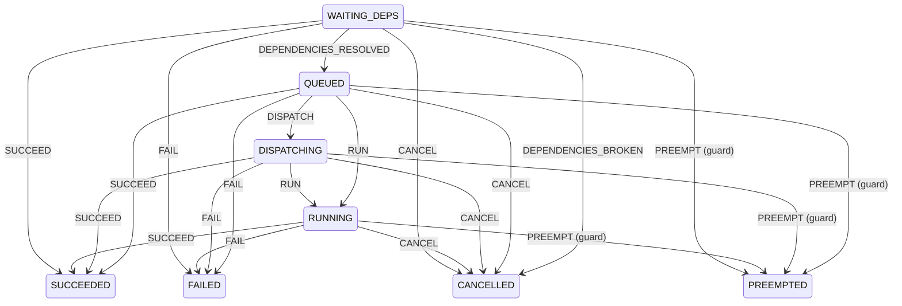

# ADR-0022: Job 라이프사이클 State Machine — 도메인 메서드 보강 사이드카

## 상태
적용

## 배경

`Job` 애그리거트는 `markRunning`, `markSucceeded`, `markFailed`, `markCancelled`,
`markPreempted`, `markReadyToQueue`, `markDispatched` 등 7~8 개의 mark* 메서드로
상태 전이를 수행한다. 각 메서드가 자기 source 상태를 if-else 로 검증하고
{@code IllegalJobTransitionException} 으로 reject — 도메인 무결성은 유지되지만,
전체 라이프사이클의 catalog 는 코드 사이에 흩어져 있다.

운영 / 신규 개발자 / docs 측에서 자주 일어나는 질문은 다음과 같다.

1. "WAITING_DEPS 에서 어떤 event 가 발생 가능?" — 코드 grep 후 7곳을 다 읽어야 답이 나온다.
2. "새 transition (예: timeout retry — DISPATCHING → QUEUED) 을 추가하려면 어디를 손대야
   하나?" — Job 클래스의 if-else 가지를 늘려야 한다. 도메인 객체가 점점 워크플로우 엔진을
   닮아 간다.
3. "라이프사이클 다이어그램이 코드와 동기화되나?" — 손으로 그린 PNG 는 항상 stale.

표준 해법은 workflow engine 도입이다. Temporal / Cadence 가 무거운 쪽, Spring StateMachine
이 가벼운 쪽. 우리는 지금 단계의 복잡도를 고려해 둘 다 도입하지 않고, minimal transition
table 을 자체 구현으로 두었다.

## 결정

### 1) Transition Table 을 데이터로 표현

`JobLifecycleStateMachine` 이 `(source, event) → target [+ guard + action]` tuple 의 list 로
모든 활성 라이프사이클 전이를 catalog 화. `JobLifecycleStateMachineFactory.build()` 가
공식 정의 — 운영자 / 신규 개발자가 한 곳에서 라이프사이클 전체를 본다.

기존 도메인 메서드는 그대로 보존한다. 이 머신은 외부 검증 + 기록 + 시각화를 담당하는
사이드카에 해당한다.

### 2) 두 방어선 (도메인 + 머신)

`JobLifecycleService` 가 도메인 메서드 호출 직전에 `lifecycleStateMachine.fire(...)` 로
같은 전이가 머신 측에서도 정의되어 있는지 검증한다.

```
service.updateStatusFromCallback(...)
  ├── lifecycleStateMachine.fire(QUEUED, RUN, job)   ← workflow 어휘 측 검증
  └── job.markRunning(clock)                          ← 도메인 무결성 측 검증
```

둘이 어긋나면 `DomainStateMachineConsistencyTest` 가 매 빌드마다 fail.

### 3) Guard — Preempt 정책 검증

`PREEMPT` 이벤트는 `PreemptionPolicy.PREEMPTABLE` 인 잡만 허용한다. 머신의 transition 에
guard 를 등록해 context (`Job` 인스턴스) 의 정책을 검사한다. 도메인의 `markPreempted`
도 같은 방어선이지만, 머신 단계에서 reject 하면 왜 거절했는지가 audit log 에 명확하게
남는다.

### 4) Mermaid 다이어그램 자동 생성 (`MermaidStateDiagram`)

머신의 transition table 을 Mermaid stateDiagram-v2 텍스트로 변환. ADR / docs / README 에
삽입할 수 있는, 코드와 동기화된 다이어그램이다.



## 왜 Spring StateMachine 라이브러리를 안 쓰는가

Spring StateMachine 은 다음을 풍부하게 제공:

- builder DSL, hierarchical states, parallel regions, history states
- StateMachinePersister + JPA — 머신 instance 를 DB 에 저장 / 복구
- listener / interceptor 체인, AOP

우리 시나리오에서 지금 필요한 것은 transition table 의 데이터 표현 + 외부 검증뿐이다.
hierarchical / parallel / history 는 over-spec. 라이브러리를 도입하면 비용이 따른다.

- 학습 곡선 (DSL / lifecycle / configurer 패턴)
- 의존성 그래프 비대 (Spring Statemachine + extensions ~수 MB)
- 기존 도메인 메서드 / JPA Job 엔티티와의 통합 추가 작업

자체 구현 50 라인 + 단위 테스트 200 라인이 현재 단계에서 더 효율적이다. transition 수가
30+ 가 되거나 hierarchical / parallel 이 필요해지는 시점에 라이브러리로 마이그레이션.

## 왜 Temporal / Cadence 도 안 쓰는가

Temporal 은 durable workflow execution 모델이다. workflow 자체가 worker process 에 의해
실행되고, 중간 상태가 자동으로 persist 된다. 가치가 발휘되는 영역은 long-running workflow
(수 분 ~ 수 일) 다.

- 외부 시스템 호출의 retry / timeout 자동 관리
- workflow 가 server crash 후 자동 재개
- saga / compensation 패턴

우리 잡의 라이프사이클은 외부 콜백 (워커 → orchestrator) 에 의해 push-driven 으로 진행된다.
orchestrator 가 workflow 를 직접 실행하지 않는다. Temporal 의 강점이 우리 모델과 어긋난다.
콜백을 받아 상태만 갱신하는 얇은 모델이라 도입 비용 (Temporal cluster 운영) 대비 회수가
약하다.

언제 Temporal 을 검토할지:
- 잡 자체가 오케스트레이션의 단위가 됐을 때 (예: hyperparameter sweep — 100 child job
  자동 spawn / 결과 aggregate / report 발행).
- 외부 의존 (S3 / SageMaker / Slack) 호출 retry / saga 가 필요할 때.
- 잡 lifecycle 이 수일 이상 살아 있고 orchestrator 가 그 사이 재시작될 가능성이 높을 때.

## 다시 검토할 시점

- transition 이 30+ 개 또는 hierarchical state (예: `RUNNING.preprocessing` /
  `RUNNING.training` / `RUNNING.uploading` 같은 sub-state) 가 필요해지면 Spring StateMachine.
- workflow 자체가 오래 살고 자체 실행이 필요하면 Temporal.
- 다른 도메인 객체 (User / Quota / Invoice) 도 라이프사이클이 복잡해지면 머신 패턴을
  공통 추상으로 (genericized `LifecycleStateMachine<S, E>`).

## 용어 풀이 (쉽게)

- **state machine (상태 기계)** — "이 상태에서 이 사건이 오면 저 상태로 간다"는 규칙표로 잡의 일생을 표현한 것. 보드게임의 "이 칸에선 이 카드만 가능" 규칙판 같은 것.
- **transition / guard (전이·문지기 조건)** — transition은 상태에서 상태로 넘어가는 한 칸, guard는 그 칸을 넘어가도 되는지 따지는 추가 조건(예: PREEMPTABLE인 잡만 선점 허용).
- **sidecar (보조 장치)** — 기존 도메인 로직은 그대로 두고 옆에 붙여 검증·기록·다이어그램만 담당하게 한 보조 부품. 본체를 안 건드리고 곁다리로 거드는 셈.
- **durable workflow (영속 워크플로우)** — Temporal처럼 작업 흐름 자체가 중간 상태까지 저장돼, 서버가 죽었다 살아나도 멈춘 데서 알아서 이어가는 모델. 며칠씩 도는 긴 작업에 어울린다.
- Temporal architecture — https://docs.temporal.io/concepts/what-is-a-workflow
- ADR-0014 (priority + preemption) — preempt transition 의 도메인 모델
- ADR-0015 (job dependencies) — DEPENDENCIES_RESOLVED / DEPENDENCIES_BROKEN 의 출처

## 참고 자료

- Spring StateMachine — https://spring.io/projects/spring-statemachine
- Temporal architecture — https://docs.temporal.io/concepts/what-is-a-workflow
- ADR-0014 (priority + preemption) — preempt transition 의 도메인 모델
- ADR-0015 (job dependencies) — DEPENDENCIES_RESOLVED / DEPENDENCIES_BROKEN 의 출처
