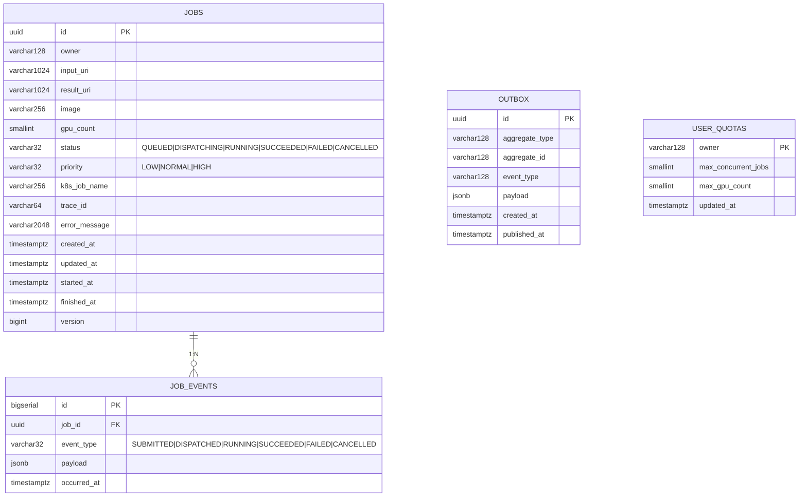

# Database Design

PostgreSQL 16 기준. 로컬 개발은 H2 (`MODE=PostgreSQL`) 로 같은 SQL 이 통하도록 짜두었다.

## 데이터 흐름 개요

```
client ──POST /jobs──▶ orchestrator-api ──INSERT──▶ jobs (QUEUED → DISPATCHING)
                              │
                              └──INSERT──▶ outbox  (JobSubmitted 이벤트, 같은 트랜잭션)
                                              │
                                       OutboxRelay (별도 스레드/스케줄러)
                                              │
                                              └──Kafka publish──▶ downstream consumers
worker ──POST /internal/jobs/{id}/status──▶ orchestrator-api ──UPDATE──▶ jobs
                                                                          │
                                                                          └──INSERT──▶ outbox (JobCompleted)
```

상태 천이는 항상 jobs 테이블의 `version` 컬럼 (JPA `@Version` — UPDATE 시 version 을
조건에 끼워 넣어 다른 트랜잭션이 먼저 바꾼 row 면 0건 update 가 나도록 만드는 패턴) 을
통해 낙관적 락 (충돌이 드물 거란 가정으로 일단 commit 시도, 충돌 나면 한쪽만 살림) 으로
보호된다. 콜백과 사용자 취소가 거의 동시에 도착해도 한쪽만 커밋되고 다른 쪽은
OptimisticLockException 으로 재시도 / 거절된다.

## ERD (Mermaid)



## 테이블 설계 근거

### `jobs` 테이블

핵심 애그리거트 (도메인에서 함께 변경되는 객체 그룹) 본체.

| 컬럼 | 타입 | 결정 근거 |
|---|---|---|
| `id` | UUID v4 | 클라이언트가 미리 생성하지 않음 (서버 측 발급). UUID 로 잡으면 분산 / 샤딩 시 충돌 없음. v4 (랜덤 기반) 면 충분, v7 (time-sortable — 시간순 정렬 가능한 UUID) 도입은 라이브러리 추가 비용이 커서 보류 |
| `status` | VARCHAR(32) | enum 대신 문자열로 두면 마이그레이션이 자유로움. 길이 32 는 향후 추가될 상태 (`SCHEDULED` 등) 여유 |
| `version` | BIGINT NOT NULL | JPA `@Version`. 콜백 · 취소 · 관리자 강제 종료가 동시 도착하는 시나리오에서 lost update (한쪽 변경이 다른 쪽 변경에 덮여 사라지는 현상) 방지 |
| `created_at` / `updated_at` | TIMESTAMP WITH TIME ZONE | 항상 UTC 저장 (`hibernate.jdbc.time_zone=UTC` — Hibernate 가 DB 에 쓸 때 UTC 로 강제 변환), 표시는 클라이언트 책임. 멀티 리전 배포 고려 |
| `started_at` / `finished_at` | TIMESTAMP WITH TIME ZONE NULL | 실행 / 종료 시각. 미시작 / 미종료는 NULL. P95 지연 등 SLO 계산의 단일 진실 |
| `error_message` | VARCHAR(2048) | 워커가 보낸 에러 메시지. 너무 길면 잘림 → 운영자는 trace_id 로 Loki (로그 저장소) 조회 |
| `trace_id` | VARCHAR(64) | OpenTelemetry trace_id (32 hex char + 여유). 메트릭 / 로그 / 트레이스 상관관계 (한 요청을 세 가지 측면에서 매칭) 의 키 |

### `job_events` 테이블

상태 천이마다 INSERT 되는 append-only (한 번 쓰면 수정·삭제 안 함) 이력. `jobs.status`
가 "현재" 라면 `job_events` 는 "어떻게 여기까지 왔는지". 디버깅, 리포팅, GPU 사용 시간
회계의 단일 진실원 (single source of truth) 이다.

`payload` 는 JSONB (PostgreSQL 의 바이너리 JSON 타입). 천이 시점 정보 (누가 호출했는지,
k8s job name 등) 가 들어가는데, 스키마 진화가 자유롭고 필요할 때만 표현식 인덱스 (특정
JSON 필드를 인덱싱) 를 추가하면 된다. `occurred_at` 은 서버 기준 시각. 보존 정책은 90일
후 파티션 단위로 DROP (별도 스케줄러).

### `outbox` 테이블

JPA 트랜잭션 안에서 `jobs` UPDATE 와 `outbox` INSERT 가 원자적으로 (둘 다 commit 또는
둘 다 rollback) 일어난다. `OutboxRelay` 가 polling 으로 미발행 건 (`published_at IS
NULL`) 을 Kafka 로 흘리고, 발행 성공 시 `published_at` 을 채운다.

Kafka 직접 produce 를 안 쓰는 이유는 단순하다. DB commit 후 Kafka 가 실패하면 이벤트가
유실되고, Kafka commit 후 DB rollback 하면 phantom event (실제로는 없는 데이터에 대한
이벤트) 가 생긴다. outbox 가 둘을 한 트랜잭션 안에 묶는다.

CDC (Change Data Capture — DB 의 binlog / WAL 을 읽어 변경을 스트리밍, Debezium) 가
아닌 polling 으로 한 건 단일 DB / 단일 서비스 규모에서 polling 이 충분하기 때문. 나중에
CDC 로 전환해도 `outbox` 테이블이 그대로 source 가 된다.

### `user_quotas` 테이블

`owner` 단위 동시 실행 Job 수와 GPU 합계를 제한한다.
`QuotaService.enforceForSubmission()` 가 해당 owner 의 active Job 수와 점유 GPU 합을
`JobRepository.sumActiveUsage` 단일 aggregate 쿼리 (한 번의 SUM / COUNT 쿼리) 로 조회한
뒤 초과 시 `429 QUOTA_EXCEEDED`. 모든 Job 을 메모리에 올리지 않는 게 포인트.

## 인덱스 설계

공통 마이그레이션 (V1, V2) 은 H2 / PG 양쪽에서 안전한 일반 인덱스. PG 운영 환경은
V3 (`migration-postgres/`) 가 partial index (특정 조건의 row 만 인덱싱) 로 교체한다.
디스크 절약 + 더 짧은 인덱스 page (인덱스 한 페이지에 들어가는 row 가 많아져 캐시 효율
↑).

**공통 (V1+V2):**

| 인덱스 | 정의 | 근거 |
|---|---|---|
| `pk_jobs` | PRIMARY KEY (id) | 단일 Job 조회 (`GET /jobs/{id}`) |
| `idx_jobs_status` | (status) | 카운트형 운영 쿼리 |
| `idx_jobs_owner_created` | (owner, created_at) | 가장 빈번한 쿼리: `GET /jobs?owner=X&page=...` |
| `idx_jobs_owner_status` | (owner, status) | 쿼터 검사: owner 의 active Job 카운트 + GPU 합계 |
| `idx_jobs_dispatch_order` | (priority, created_at) | 디스패처 / 스케줄러가 우선순위 순 큐에서 꺼낼 때 |
| `idx_job_events_job_occurred` | (job_id, occurred_at) | 단일 Job 의 이력 조회 |
| `idx_outbox_unpublished` | (published_at, created_at) | relay polling 시작 컬럼 |

**PG 전용 partial index (V3, `migration-postgres/V3__pg_partial_indexes.sql`):**

운영 환경에서 jobs 의 99% 이상이 SUCCEEDED/FAILED 가 되는 시점이 오면 active 만 인덱싱 → 디스크 절약.

```sql
-- V2 의 일반 인덱스를 drop 하고 partial 로 교체. H2 미지원이라 prod 에서만.
DROP INDEX IF EXISTS idx_jobs_dispatch_order;
CREATE INDEX idx_jobs_dispatch_order_active ON jobs (priority, created_at)
    WHERE status IN ('QUEUED', 'DISPATCHING', 'RUNNING');

DROP INDEX IF EXISTS idx_outbox_unpublished;
CREATE INDEX idx_outbox_unpublished ON outbox (created_at)
    WHERE published_at IS NULL;
```

`prod` 프로필의 `spring.flyway.locations: classpath:db/migration,classpath:db/migration-postgres` 가
V3 를 적용한다. 로컬(H2)은 V2 까지만 적용 → SQL 방언 차이 없이 동작.

## 동시성 처리

### 낙관적 락 (`@Version`)

낙관적 락 = 충돌이 드물 거란 가정으로 일단 commit 시도, 충돌 나면 한쪽만 살리는 방식.
워커 콜백, 사용자 취소, 관리자 force-fail (강제 실패 처리) 이 같은 Job 에 동시 도착하는
시나리오:

```
T1: SELECT job WHERE id=X → version=5
T2: SELECT job WHERE id=X → version=5
T1: UPDATE job SET status='SUCCEEDED', version=6 WHERE id=X AND version=5  -> OK
T2: UPDATE job SET status='CANCELLED', version=6 WHERE id=X AND version=5  -> 0 rows
    -> OptimisticLockException -> 503 또는 비즈니스 룰에 따라 처리
```

비관적 락 (`SELECT ... FOR UPDATE` — 처음부터 행을 잠그고 다른 트랜잭션은 대기시키는
방식) 대신 낙관적 락을 선택한 이유:
- 충돌 빈도가 낮다 (단일 Job 에 동시 작업이 들어오는 경우는 드뭄)
- 락 경합 없음 → 처리량 ↑
- 충돌 시 클라이언트가 retry 하거나 도메인 규칙으로 해결

### 비관적 락이 필요한 곳

쿼터 검사는 read-modify-write (읽고-계산하고-쓰는 흐름) 가 동시에 발생하면 한도를 살짝
넘기는 over-commit 가능. 이 부분만 advisory lock (애플리케이션이 직접 잠금 키를 정해
거는 PG 전용 락) 또는 트랜잭션 격리 SERIALIZABLE (가장 엄격한 격리 — 동시 트랜잭션을
직렬 실행한 것처럼 보이게) 로 보호:

```sql
-- 쿼터 검사 트랜잭션 시작 시
SELECT pg_advisory_xact_lock(hashtext('quota:' || :owner));
```

## 마이그레이션 정책

Flyway, naming convention 은 `V<version>__<description>.sql`. 모든 변경은 forward-only
(되돌리는 마이그레이션 없이 앞으로만 진행) 다. 컬럼 drop 은 두 단계로 나눈다. 먼저
코드에서 사용을 중단하고, 다음 릴리스에서 마이그레이션 실행. breaking schema change 는
dual-write (양쪽 컬럼 모두 쓰기) → backfill (과거 데이터 채우기) → cutover (새 컬럼만
사용으로 전환) 패턴. 운영에서는 `flyway.outOfOrder=false` 로 두어 머지 순서대로만
적용된다.

## 운영 고려

읽기 부하가 늘면 read replica (읽기 전용 복제본 DB) 분리. JPA
`@Transactional(readOnly = true)` + RoutingDataSource (트랜잭션 속성을 보고 master /
replica 로 자동 라우팅하는 Spring 컴포넌트) 로 라우팅하면 코드 변경이 거의 없다.

`job_events` 가 가장 먼저 커지는 테이블이라 월 단위 파티셔닝 (테이블을 시간 범위로
잘게 나눔) + 90일 후 detach (오래된 파티션 떼어내기) 가 답이다.

백업은 Postgres WAL archiving (Write-Ahead Log 를 외부로 푸시하는 PG 백업 방식) + 일일
logical dump (pg_dump 출력) 를 MinIO 에. RPO 5분 / RTO 30분이 목표.

연결 풀은 HikariCP. 권장 maximumPoolSize 는 `(2 × 코어 수) + 디스크 큐 깊이`. 16 코어
클러스터에 orchestrator-api Pod 가 2 replica 면 Pod 당 8~16 정도. DB 측 max_connections
와 합산해서 여유를 남겨두는 게 안전하다.
